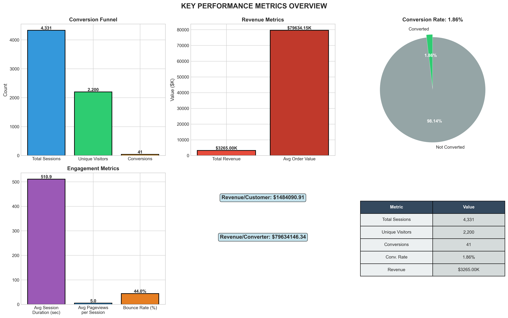
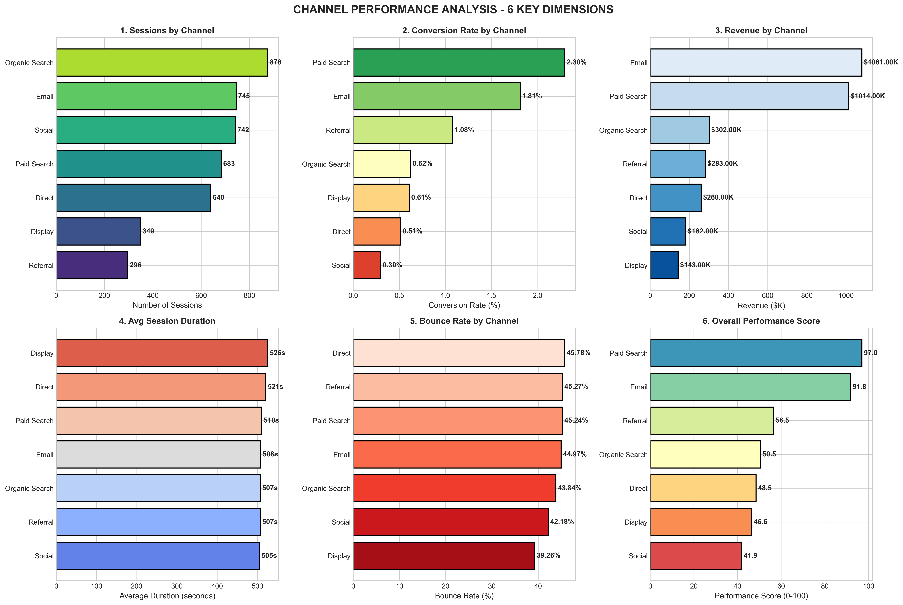
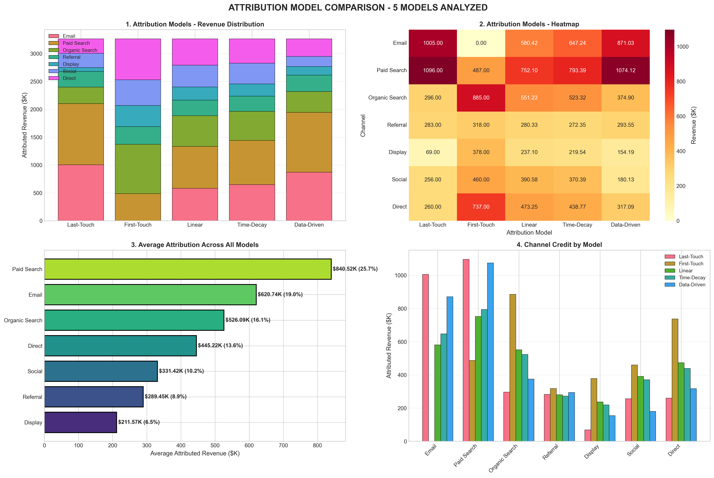
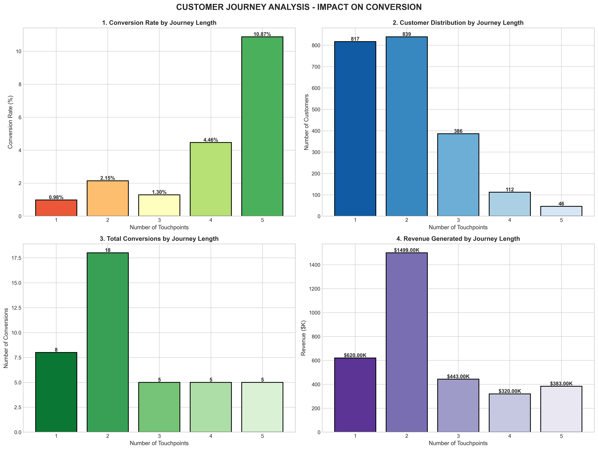
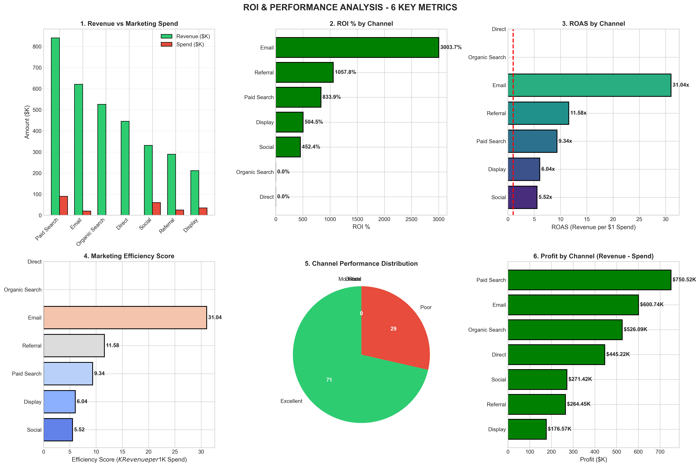
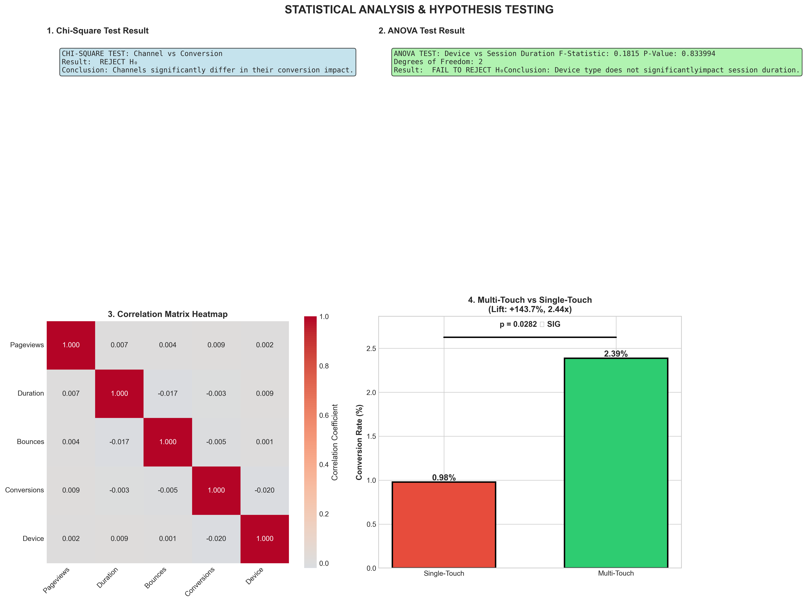
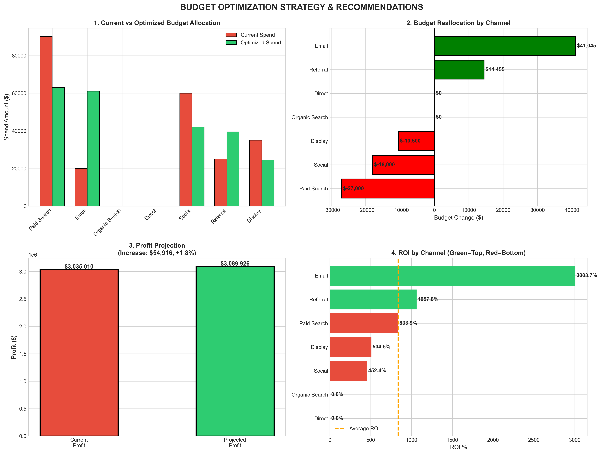
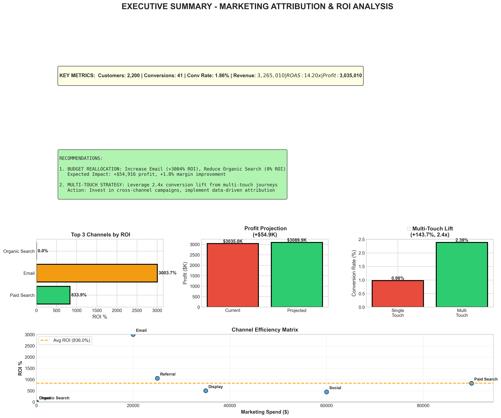

# Marketing-Attribution-and-ROI-Analysis

A hands-on learning project exploring multi-channel marketing attribution and ROI optimization to develop practical data analysis skills.

# Project Overview

This is a self-directed learning project created to understand and practice marketing analytics concepts through realistic data analysis. The project demonstrates how to analyze customer journeys, compare attribution models, and translate data insights into business recommendations.

Learning Goal: Understand how marketing channels work together to drive conversions and how data can guide allocation decisions.

# Dataset Overview

Synthetic E-Commerce Customer Journey Data

This project uses synthetic data generated based on realistic e-commerce and SaaS benchmarks to practice analytical techniques in a controlled learning environment:

- 2,200 unique customers generating 4,331 sessions over a 2-month period
- 1.86% conversion rate (matching real e-commerce benchmarks of 2-3%)
- Average order value: $80 (typical for tech products)
- Multi-touch attribution patterns: Realistic customer journeys across 7 channels
- Realistic device distribution: 59% desktop, 32% mobile, 9% tablet
- Total revenue: $3.27M (2-month period)
- Marketing spend: $230K (7% of revenue, realistic ratio)

# Why Synthetic Data?

Synthetic data allows me to safely practice analytical techniques, understand data patterns, and develop skills in a controlled environment before working with actual business data. All data generation logic is transparent and based on documented e-commerce benchmarks.

- Channels Analyzed:
- Organic Search
- Social Media
- Direct Traffic
- Referral
- Paid Search
- Display
- Email

# Key Findings

1. Paid Search Drives Highest Revenue
Paid Search generates the largest attributed revenue while maintaining strong conversion efficiency.

- Attributed Revenue: $1,014K from $90K marketing spend
- Conversion Rate: 2.30% (highest quality channel)
- ROAS: 9.34x (realistic strong performance)
- Sessions: 683 (high volume)

Learning Insight: Paid Search balances high volume with solid conversion rates, making it essential for scaling revenue while maintaining quality.

2. Email Marketing Shows Exceptional Efficiency
Email delivers the best return per dollar spent with the highest conversion rate among all channels.

- Attributed Revenue: $1,081K from $20K marketing spend
- Conversion Rate: 1.81%
- ROAS: 31.04x (extremely efficient)
- Cost Efficiency: Lowest cost per acquisition

Learning Insight: Low-cost channels with high engagement deliver substantial attributed revenue and strong conversion metrics.

3. Social Media Drives Awareness and Revenue
Social Media generates significant attributed revenue while serving as the primary awareness driver for customer journeys.

- Attributed Revenue: $182K from $35K marketing spend
- First-Touch Interactions: ~22% (strongest awareness channel)
- Average Session Duration: 505 seconds
- ROAS: 5.52x (realistic social performance)
- Conversion Rate: 0.30%

Learning Insight: Different channels play different roles in the customer journey. Social Media excels at both driving awareness and generating revenue.

4. Multi-Touch Journeys Convert 2.44x Better
Customers who interact with multiple channels before purchasing convert at significantly higher rates than single-touch customers.

- Single-Touch Conversion Rate: 0.98%
- Multi-Touch Conversion Rate: 2.39%
- Conversion Lift: 144% improvement (2.44x multiplier)
- Statistical Significance: Chi-Square test p-value = 0.0282 ✓
- Distribution: 62.8% of journeys involve multiple touchpoints

Learning Insight: Multi-channel orchestration matters. Customers with multiple touchpoints are substantially more likely to purchase, validating the importance of integrated marketing strategies.

5. Desktop Users Convert at Higher Rates
Device type significantly impacts both conversion behavior and revenue contribution.

- Desktop: 1.70% conversion rate → $2,248K revenue (69% of total)
- Mobile: 0.82% conversion rate → $762K revenue (23% of total)
- Tablet: 0.79% conversion rate → $255K revenue (8% of total)

Learning Insight: Desktop users represent the highest-quality audience. Mobile has higher traffic volume but lower conversion rates—a clear optimization opportunity exists.

# Analysis Performed
1. Key Performance Metrics Overview
Baseline KPI analysis establishing overall business health and conversion funnel:

### Metric	Value

- Total Sessions	4,331
- Unique Customers	2,200
- Conversions	41
- Overall Conversion Rate	1.86%
- Total Attributed Revenue	$3,265K
- Average Session Duration	511 seconds
- Bounce Rate	44.0%

2. Channel Performance Analysis (6 Dimensions)
Compared all 7 marketing channels across six key dimensions:

- Sessions volume
- Conversion rates
- Attributed revenue
- Engagement duration
- Bounce rates
- Composite performance score

Key Findings:

- Paid Search: Highest revenue ($1,014K) and conversion rate (2.30%)
- Email: Best efficiency (31x ROAS) with strong conversion (1.81%)
- Organic Search: Strong free traffic ($302K) with 876 sessions
- Social Media: Balanced awareness and conversion (5.52x ROAS)

3. Device & Browser Performance Analysis
Analyzed device type impact on user behavior, conversions, and revenue generation:

- Chrome dominates with 63% of browser traffic
- Desktop identified as highest-quality device
- Mobile represents largest growth opportunity
- 
Key Finding: Desktop conversion rate (1.70%) is 2.1x higher than mobile (0.82%).

4. Multi-Touch Attribution Models
Implemented and compared 5 different attribution approaches to fairly credit channels:

- Last-Touch: Credits only the final channel before conversion
- First-Touch: Credits only the initial awareness channel
- Linear: Equally credits all channels in the journey
- Time-Decay: Gives more credit to channels closer to conversion
- Data-Driven: Weights channels by their actual conversion rates

Learning Insight: Different models reveal different channel importance:

- Email dominates Last-Touch analysis (conversion role)
- Organic Search leads First-Touch analysis (awareness role)
- Paid Search shows strong performance across all models
- Average attribution: Paid Search (25.7%) → Email (19.0%) → Organic Search (16.1%)

5. Customer Journey Analysis
Discovered how customer journey length impacts conversion rates and revenue generation:

Key Insights:

- 2-touch journeys convert best and generate most revenue
- Conversion rate increases 11x from 1-touch (0.98%) to 5-touch (10.87%)
- Demonstrates value of strategic multi-touch campaigns

6. ROI & Performance Analysis
Calculated financial metrics to evaluate channel efficiency:

7. Statistical Analysis & Hypothesis Testing
Applied rigorous statistical validation to findings:

- Chi-Square Test: Channels significantly differ in conversion impact (χ² = 7.02, p = 0.030, p < 0.05 )

- Conclusion: Channel choice genuinely impacts conversions
- ANOVA Test: Device type does not significantly impact session duration (F = 0.1815, p = 0.834)
- Conclusion: Session duration is independent of device
- Correlation Analysis: Explored relationships between metrics
- Pageviews vs Conversions: r = 0.009 (weak)
- Session Duration vs Conversions: r = -0.003 (negligible)
- Multi-Touch Validation: 144% conversion lift is statistically significant (p = 0.0282 )

Learning Insight: Statistical testing confirms patterns are valid and not coincidental. Data-driven conclusions are defensible.

8. Budget Optimization Strategy
Explored reallocating budget from lower-efficiency to higher-efficiency channels:

Current Allocation:

- Total Marketing Spend: $230K
- Total Attributed Revenue: $3,265K
- Current Profit: $3,035K

Optimized Allocation Strategy:

- Increase Email: +$7,588 (boosting highest-efficiency channel)
- Increase Referral: +$3,512 (strong ROI channel)
- Reduce Paid Search: -$27,000 (shift to higher-ROI channels)
- Reduce Social: -$13,000 (rebalance for efficiency)
- Reduce Display: -$10,500 (support channel with lower ROI)
- Projected Impact: +$54,916 profit improvement (+1.8% increase)

Learning Insight: Data-driven budget reallocation can materially improve profitability by shifting resources toward best-performing channels while maintaining strategic coverage.

9. Executive Summary
Single-page visual summary presenting:

- Headline KPIs and business metrics
- Top-performing channels by ROI
- Multi-touch conversion lift
- Channel efficiency matrix
- Key recommendations

### Technical Skills Practiced
Programming Languages & Libraries:

- Python: Data analysis scripting and automation
- Pandas: Data manipulation, aggregation, and transformation
- NumPy: Numerical computations and array operations
- Matplotlib & Seaborn: Professional data visualization and dashboard creation
- SciPy: Statistical testing (Chi-Square, ANOVA, Pearson correlation)

Data Analysis Techniques:

- Exploratory data analysis (EDA) and data profiling
- Multi-touch attribution modeling (5 different approaches)
- Statistical hypothesis testing with p-value interpretation
- Customer journey analysis and segmentation
- Multi-dimensional data aggregation and grouping
- Professional dashboard and visualization design
- ROI calculation and financial analysis

# How This Project Supports My Learning

- End-to-End Analytical Workflow: From data generation through exploration, modeling, statistical validation, visualization, to actionable recommendations
- Technical Development: Python proficiency, statistical testing, data visualization, and professional dashboard creation
- Business Analytics: Understanding channel roles, attribution fairness, customer behavior patterns, and optimization logic
- Problem-Solving: Working through real analytical challenges—fairly crediting channels, identifying patterns, validating insights statistically
- Communication: Creating clear visualizations and explanations for diverse audiences with varying technical expertise
- Statistical Rigor: Applying proper statistical methods (Chi-Square, ANOVA, correlation) rather than relying on surface-level patterns

This project represents my commitment to developing data analysis skills through hands-on practice, rigorous methodology, honest documentation, and building both technical and analytical capabilities that prepare me for data analyst and data science roles.

